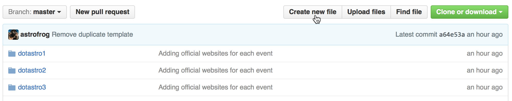
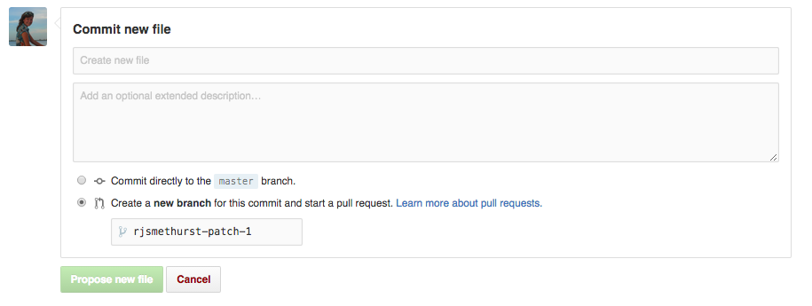
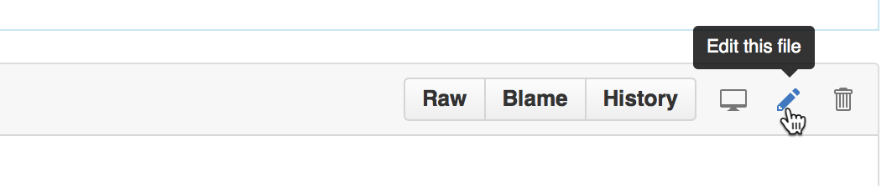
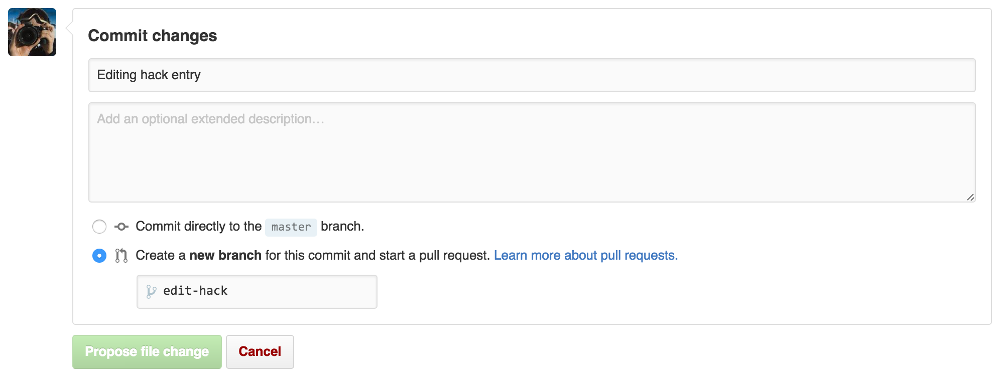

# List of .Astronomy hacks

This repository is intended to contain information about all hacks (coding or otherwise) that have
been carried out as part of the .Astronomy meetings. Each meeting has a folder
which in turn contains one file for each hack. Adding a file to this repository
is easy, and we describe the file format and the steps to take to add a file
below.

## Submitting a hack the easy way

Go to [the hack submission web
app](https://dotastronomy-hack-submitter.herokuapp.com) and enter the
relevant details. This will create a pull request from you automatically,
which you can modify later if desired (see the section on [Updating a hack](#updating))

## Submitting a hack via GitHub

###Creating the file

First navigate to the correct conference folder e.g.
[dotastro8](https://github.com/dotastro/hack-list/tree/master/dotastro8),
then click on the "Create new file" button on the top right side of the page.

### The file format

Each hack should be described by a file that looks like this:

    title: My awesome hack
    creators:
        - Anne Onymous
        - John Doe
    description: this was a hack to do this really cool thing
    source-url: http://github.com/hacker1/hack1
    live-url: http://hack1.herokuapp.com
    doi: http://zenodo.org/1029812
    images: hack1.jpg
    
This format is provided in the [template.yml](https://github.com/dotastro/hack-list/blob/master/template.yml) file in this repo. The file format is called YAML, but you don't need to worry if you don't know
this or how to submit the pull-request - we explain all the details below.

The ``title``, ``creators``, and ``description`` fields are always required

The following fields are optional:

* ``source-url``: for code hacks, this is the URL or URLs to where the source
  code for the hack is stored - this can be for example a GitHub or BitBucket
  repository.
  
* ``live-url``: when applicable, this is the URL or URLs for the 'finished' product,
  for example a website or a video link.

* ``doi``: if you archive your hack on a service such as
  [Zenodo](https://zenodo.org) or [figshare](https://figshare.com) (and we
  highly encourage you to do so - see instructions below), this is the DOI to
  that archived version.
  
* ``images``: if you have screenshots or other related images for your hacks,
  you can include the filenames here, and include the images in your submission.

* ``contact-email``: contact details for one of the hack participants who we
  could contact in future if needed.
  
* ``contact-github``: the GitHub username for one or more of the hack
  participants who we could contact in future if needed.
  
* ``orcid``: the ORCID(s) for one or more of the participants

Note that if you need to give multiple values for a field (such as for
creators, URLs, ORCID IDs), you can use the following syntax:

    fieldname:
        - value1
        - value2
        
If you want to put a paragraph of text, e.g. for the description, you can do:

    fieldname: >
      Hic autem sit officia. Et accusantium molestias dicta laboriosam qui.
      Deleniti est soluta voluptatem aut. Officia sed ipsum iste quos debitis
      modi aut. Est nihil in ea harum animi est doloremque. Aut ut aut aut.
      
That is, you should put a ``>`` on the first line then indent all the rest by a
couple of spaces.

### Opening a pull request

Once you are happy with the .yml file describing your hack, scroll to the
bottom of the page and select the "Create a new branch" option to start a
pull request.

Make sure you give an appropriate commit message and then click on the big
green "Propose new file" button.

This will then set up a pull request for you and will let the .Astronomy team
know that you would like your hack added to this repo and then if everything
is ok with your submitted .yml file and it passes our tests then we'll merge
your changes.

Ta Da! Your hack is now archived for the joy of future generations!

### Updating a hack

Whether you submit a hack via the web form or via GitHub, subsequent updates
should be done via GitHub. Assuming that the hack entry you want to edit is
inside the main [hack-list](http://github.com/dotastro/hack-list) repository,
navigate to the folder for the relevant .Astronomy meeting, then click on the
file you want to edit. Once the contents of the file show, click on the pen
icon in the upper right to edit the file:

Once you have made the edits, scroll down to the bottom of the page, and then
enter a commit message and select to create a new branch, optionally giving a
name to the branch:

## Badge/Shield

You can also add the dotastro shield badge to the README.md file of your
hack's source code by including the following markdown code:

    

